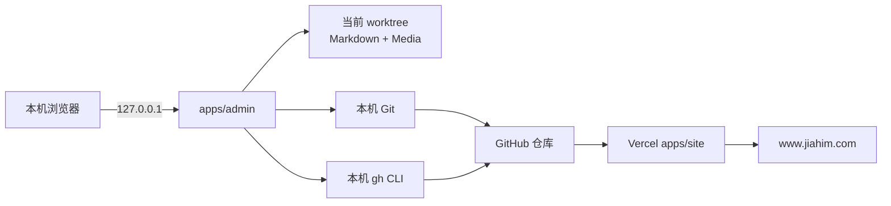
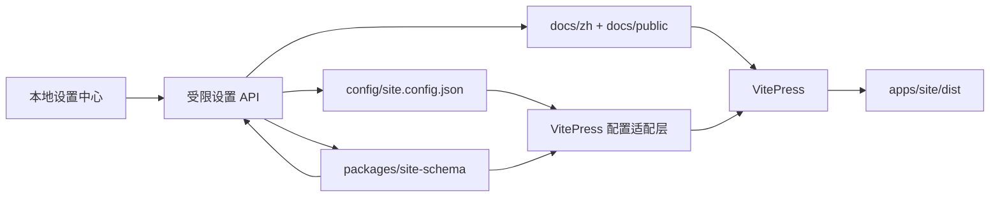

# Jia him 本地文章工作台设计文档

> 本文描述产品架构与技术边界。视觉语言、组件密度、字号、间距和动效以仓库根目录的 [`DESIGN.md`](../../DESIGN.md) 为准。

| 项目 | 内容 |
| --- | --- |
| 文档状态 | Approved |
| 版本 | v1.1 |
| 日期 | 2026-09-01 |
| 对应 PRD | [`PRD.md`](./PRD.md) |

## 1. 方案摘要

仓库使用 pnpm workspace：`apps/site` 构建 VitePress 静态站点，`apps/admin` 是只在本机运行的 Next.js 编辑工作台，`docs` 是共享 Markdown 内容源。管理端绑定 `127.0.0.1`，不部署、不认证、不持有远端凭据。

工作台采用三栏桌面布局：左侧可折叠文章列表，中间 CodeMirror Markdown 源码编辑器，右侧实时预览与文章大纲。保存通过本地文件系统完成；版本控制通过受限 Git 服务层完成；Pull Request 和合并通过本机 GitHub CLI 完成。

## 2. 架构与边界



- `apps/admin` 只允许本机访问，启动命令绑定 `127.0.0.1`。
- 浏览器不接触 GitHub Token、SSH 私钥或任意 shell。
- 服务端只能访问当前仓库、允许内容目录和当前文章会话文件。
- 公开站点构建不依赖管理端，静态产物不得包含 `/admin`。

## 3. 目标目录结构

```text
apps/admin/src/
├── app/                         # 页面与本地 Route Handlers
├── components/
│   ├── AdminApp.tsx             # 工作台状态协调
│   ├── ArticleSidebar.tsx       # 搜索、筛选、列表与折叠
│   ├── EditorPane.tsx           # 元数据与 CodeMirror
│   ├── PreviewPane.tsx          # 预览、大纲与同步
│   ├── WorkspaceHeader.tsx      # 保存与 Git 操作
│   └── GitPanel.tsx             # diff、历史、提交与 PR
├── lib/
│   ├── content/                 # 内容解析、保存和媒体
│   ├── editor/                  # 大纲与草稿恢复纯函数
│   └── git/                     # 状态解析、受限命令与工作流
└── test/                        # Vitest 配置与夹具
```

现有文件渐进拆分，内容解析逻辑不做无关重写。

## 4. 前端信息架构

```text
┌────────────────────────────── 顶栏 ──────────────────────────────┐
│ 品牌 / 分支状态                保存  差异  提交并推送  合并并发布 │
├──────────┬─────────────────────────────┬────────────────────────┤
│ 文章列表 │ Markdown 源码               │ 预览 / 大纲            │
│ 搜索分类 │ 标题、元数据、CodeMirror    │ 实时渲染、滚动同步     │
│ 文章状态 │                             │                        │
└──────────┴─────────────────────────────┴────────────────────────┘
```

- 展开网格：`300px minmax(420px, 1.35fr) minmax(320px, .9fr)`。
- 收起网格：窄分隔轨道加位于轨道右侧的展开按钮；具体尺寸以根目录视觉 `DESIGN.md` 为准。
- 折叠状态写入 `localStorage`，默认展开；按钮提供 `aria-expanded`。
- 低于 980 px 时右栏可切换；低于 760 px 时文章列表改为抽屉。

组件职责：

- `AdminApp`：加载文章、选择文章、协调保存和全局反馈。
- `ArticleSidebar`：搜索、分类、列表、新建和折叠状态。
- `EditorPane`：标题、元数据、CodeMirror、字数和快捷键。
- `PreviewPane`：安全 Markdown、预览/大纲切换和滚动同步。
- `WorkspaceHeader`：保存状态与 Git 操作入口。
- `GitPanel`：diff、历史、提交信息、PR 和错误状态。

## 5. 编辑体验

### 5.1 CodeMirror

使用 CodeMirror 6 React 包装层，开启 Markdown 高亮、行号、当前行高亮、括号匹配、自动闭合、历史、查找和 `Mod-s` 保存。编辑器高度跟随工作区并独立滚动。

标题和元数据保留为结构化表单，正文保持原始 Markdown。保存时继续使用现有 `article-format` 合并未知 frontmatter 并同步一级标题。

### 5.2 草稿恢复

恢复键为 `jiahim:draft:<article-path-or-new-id>`，内容包含文章字段、保存时间和源文件指纹。编辑后延迟写入 `localStorage`，成功落盘后删除。恢复副本较新时显示恢复/放弃选择，不静默覆盖文件。

### 5.3 预览与大纲

- `react-markdown` + `remark-gfm`，不启用 `rehype-raw`。
- 从 Markdown 标题提取 `OutlineItem { level, text, line }`。
- 点击大纲项使编辑器定位到对应行。
- P0 使用编辑区/预览区滚动比例同步，开关默认开启并持久化。

## 6. 内容与媒体

| 分类 | 目录 |
| --- | --- |
| 随笔 | `docs/zh/essay` |
| 技术文章 | `docs/zh/skill` |
| 工作经验 | `docs/zh/work` |
| 读书笔记 | `docs/zh/book` |

- 递归读取 `.md`，排除任意层级 `index.md`。
- 路径校验拒绝绝对路径、`..`、反斜杠和允许目录外目标。
- 新文章为 `{category}/{YYYY-MM-DD}-{slug}.md`。
- 媒体为 `docs/public/images/articles/{YYYY}/{MM}/{name}-{suffix}.{ext}`。
- 图片白名单 PNG/JPEG/GIF/WebP/AVIF，单文件不超过 8 MB。
- 文件保存升级为同目录临时文件加原子 rename。

## 7. 本地 API

| 方法 | 路径 | 作用 |
| --- | --- | --- |
| `GET` | `/api/articles` | 文章摘要列表 |
| `GET` | `/api/article?path=...` | 文章详情 |
| `POST/PUT` | `/api/article` | 新建或保存 |
| `POST` | `/api/media` | 保存图片 |
| `GET` | `/api/git/status` | 分支、变更、同步和阻塞状态 |
| `GET` | `/api/git/diff?path=...` | 当前文章 diff |
| `GET` | `/api/git/history?path=...` | 当前文章历史 |
| `POST` | `/api/git/publish` | 分支、精确暂存、提交、推送和 PR |
| `POST` | `/api/git/merge` | squash merge PR |

所有响应为 `no-store`。写 API 校验 Origin/Host 为回环地址。

## 8. Git 服务

### 8.1 状态

```ts
interface GitStatus {
  branch: string | null
  defaultBranch: string
  remote: string | null
  changedFiles: GitChangedFile[]
  ahead: number
  behind: number
  operation: 'none' | 'merge' | 'rebase' | 'cherry-pick'
  conflicts: string[]
  canWrite: boolean
  blockReason?: string
}
```

使用 `git status --porcelain=v2 --branch -z` 和仓库元数据计算。detached HEAD、冲突、进行中的 Git 操作或缺少 remote 时 `canWrite=false`。

### 8.2 命令约束

使用 Node `execFile` 风格参数数组，固定可执行文件为 `git` 或 `gh`，工作目录固定为仓库根。用户输入只作为独立参数，并在调用前校验。

禁止 force push、reset、rebase、stash、clean、覆盖文件的 checkout 和 `git add .`。

### 8.3 提交并推送

1. 重新读取状态并检查阻塞条件。
2. 若当前为默认分支，创建唯一 `content/YYYY-MM-DD-<slug>` 分支。
3. 校验当前文章和本次媒体路径，执行 `git add -- <exact paths>`。
4. 校验 staged 集合没有目标外文件；发现来源不明暂存时停止，不自动取消。
5. `git commit -m "[Human] docs: ..."`。
6. `git push --set-upstream origin <branch>`，绝不 force push。
7. 通过 `gh pr view` 复用 PR，或 `gh pr create --base main --head <branch>` 创建。

失败时不运行 reset，保留现场并返回可操作提示。

### 8.4 合并并发布

- API 需要 `confirm: true` 和明确 PR number。
- 重新确认没有未保存内容、分支已推送且 PR 可合并。
- 运行 `gh pr merge <number> --squash --delete-branch`，不使用 admin 绕过。
- 合并成功后刷新状态，不自动清理 worktree 或切回默认分支。

## 9. 测试策略

- 单元测试：搜索、大纲、草稿恢复、Git porcelain 解析、分支命名、路径与暂存集合验证。
- 组件测试：默认三栏、折叠/展开、文章选择、快捷键保存、预览/大纲切换、按钮禁用条件。
- Git 集成测试：临时仓库验证精确暂存和提交；不访问真实远端。
- 静态验证：`pnpm typecheck`、`pnpm test`、`pnpm build:admin`、`pnpm build:site`、`git diff --check`。
- 浏览器验收：桌面展开态、折叠态、编辑预览和窄屏降级；控制台无错误。

## 10. 取舍

- 本地 Next.js 而非 Electron/Tauri：复用现有实现，启动轻。
- CodeMirror 6 而非 textarea：获得成熟 Markdown 编辑能力。
- 本机 Git + `gh` 而非 GitHub App：无需部署和保存凭据。
- PR 发布而非直接推送 `main`：保留预览、检查和回滚路径。
- P0 不做可拖拽栏宽：优先稳定三栏信息架构和折叠。

## 11. 已确认项

- [x] 管理端仅本机运行，不部署独立域名。
- [x] 使用 monorepo，公开站点继续 Vercel 静态部署。
- [x] 默认三栏，左栏是可收起文章列表。
- [x] 中栏 Markdown 源码，右栏实时预览与大纲。
- [x] 使用本地 Git 完整安全发布流程。
- [x] “提交并推送”与“合并并发布”分离。
- [x] 提交只包含当前文章和本次会话媒体。

## 12. v1.1 统一站点配置架构

### 12.1 组件关系



边界说明：

- JSON 保存数据，不保存可执行代码。
- `packages/site-schema` 是唯一类型与校验来源，同时供 Node 管理端和 VitePress 构建使用。
- VitePress 适配层将通用配置映射为 `defineConfig`、`themeConfig`、`nav`、`sidebar`、`head`、robots、sitemap、feed 和 JSON-LD。
- 无法通用化的高级 VitePress 插件仍保留在代码配置中，不允许设置中心覆盖任意代码。

### 12.2 目标目录

```text
config/
└── site.config.json
packages/
└── site-schema/
    ├── package.json
    └── src/
        ├── schema.ts
        ├── defaults.ts
        ├── migrations.ts
        ├── validation.ts
        └── index.ts
apps/admin/src/
├── components/settings/
├── lib/settings/
└── app/api/settings/
docs/.vitepress/
├── config/
│   ├── adapter.ts
│   └── ...
└── generators/
    ├── structured-data.ts
    ├── robots.ts
    └── feed.ts
```

### 12.3 顶层配置模型

```ts
interface SiteConfiguration {
  schemaVersion: 1
  site: SiteIdentity
  branding: BrandingConfiguration
  author: AuthorConfiguration
  locales: Record<string, LocaleConfiguration>
  sections: SectionConfiguration[]
  navigation: NavigationItem[]
  homepage: HomepageConfiguration
  appearance: AppearanceConfiguration
  seo: SeoConfiguration
  geo: GeoConfiguration
  footer: FooterConfiguration
  integrations: PublicIntegrationConfiguration
}
```

配置以 JSON 保存，但所有消费者只通过共享包的 `parseSiteConfiguration` 读取。Schema 负责默认值、严格字段检查、路径规范、唯一 ID、唯一路由、栏目父子关系无环和版本迁移。

### 12.4 栏目模型

```ts
interface SectionConfiguration {
  id: string
  locale: string
  name: string
  description?: string
  directory: string
  route: string
  parentId?: string
  order: number
  navigation: {
    header: boolean
    sidebar: boolean
    collapsed: boolean
  }
  status: 'active' | 'hidden' | 'archived'
}
```

- `id` 创建后不可修改，用于文章归属和未来翻译映射。
- `directory` 必须位于对应 locale 的内容根目录，拒绝绝对路径、`..`、反斜杠和符号链接越界。
- 已含文章的栏目不允许在普通表单修改 `directory` 或 `route`。
- 网站导航和编辑器目录树使用同一排序函数与同一栏目树构建器。
- `index.md` 不进入文章列表，但作为栏目落地页由网站继续渲染。

### 12.5 设置中心组件

```text
SettingsWorkspace
├── SettingsSidebar       # 设置分组
├── SettingsFormHost      # 表单与未保存状态
│   ├── GeneralSettings
│   ├── SectionManager
│   ├── NavigationManager
│   ├── HomepageSettings
│   ├── AppearanceSettings
│   ├── SeoGeoSettings
│   ├── FooterSocialSettings
│   └── IntegrationSettings
└── SettingsInspector     # 预览、校验、Git Diff
```

`AdminApp` 只负责文章/设置主模式和共享 Git 状态；设置表单状态下沉到 `SettingsWorkspace`，避免继续扩大单一组件。栏目树构建、配置校验和 diff 摘要保持纯函数，便于网站和后台复用测试。

### 12.6 设置 API

| 方法 | 路径 | 作用 |
| --- | --- | --- |
| `GET` | `/api/settings` | 读取已校验配置及内容哈希 |
| `POST` | `/api/settings/validate` | 校验草稿，不写文件 |
| `PUT` | `/api/settings` | 使用基准哈希保存配置 |
| `POST` | `/api/settings/sections` | 事务式新增栏目和 `index.md` |
| `PATCH` | `/api/settings/sections/:id` | 修改安全栏目字段 |
| `POST` | `/api/settings/sections/:id/archive` | 隐藏或归档栏目 |
| `POST` | `/api/settings/assets` | 保存白名单品牌资源 |

API 延用回环 Host/Origin 检查和 `no-store`。所有路径由服务端根据栏目 ID 与 Schema 解析，客户端不能提交任意目标路径。

### 12.7 保存、并发和事务

1. `GET /api/settings` 返回配置、标准化结果和 SHA-256 内容哈希。
2. 浏览器保存草稿时提交 `baseHash`。
3. 服务端重新读取文件；哈希不同则返回 `409`，要求重新加载并人工合并。
4. Schema 校验通过后，在同目录写临时文件并原子 rename。
5. 新建栏目先验证全部目标，记录本次将创建的文件，再写临时文件并逐项 rename。
6. 任一步失败时恢复旧配置，只清理本次事务创建的临时文件或空目录，不触碰既有内容。
7. 保存成功后刷新 Git 状态；提交范围由设置会话记录精确文件集合。

### 12.8 VitePress 适配

- `shared.ts` 从解析后的配置生成站点标题、描述、head、Logo、页脚、社交链接、outline 和 sitemap hostname。
- `zh.ts` 从栏目树生成 nav 和 sidebar，禁止维护第二份栏目列表。
- 文章目录继续递归读取 Markdown；顺序由共享栏目设置和文章排序规则决定。
- 首页模块由配置映射到 VitePress 主题组件或首页数据，不在 JSON 中存放 Vue 代码。
- Vercel 项目继续从仓库根执行 `pnpm build:site`，输出 `apps/site/dist`；管理端不参与线上构建。

### 12.9 SEO/GEO 生成

`seo` 负责 canonical、标题模板、描述、Open Graph、索引策略和 sitemap。`geo` 负责爬虫策略与确定性内容完整性检查，两者共享文章元数据和结构化数据生成器。

默认策略：

- 允许 Googlebot 和 OAI-SearchBot 发现公开内容。
- 禁止 GPTBot 和 Google-Extended 用于模型训练或扩展用途。
- 搜索发现与训练权限独立配置。
- `llms.txt` 默认关闭；启用时在界面标注实验性、非统一标准。

结构化数据仅从真实可见内容生成 `WebSite`、`Person`、`BlogPosting` 和 `BreadcrumbList`。后台给出缺失字段、标题层级、图片 alt、失效引用和 canonical 冲突等明确问题，不计算综合排名分数。

### 12.10 测试边界

- Schema：默认值、非法字段、唯一性、栏目环、路径越界、版本迁移。
- 共享树：网站 nav/sidebar 与编辑器目录树使用同一夹具并得到一致结构。
- API：Origin/Host、并发哈希、原子写入、栏目事务和路径白名单。
- 生成器：robots、sitemap、feed、canonical 和 JSON-LD 快照及语义断言。
- UI：模式切换、表单草稿、栏目排序、归档确认、冲突反馈和保存后 diff。
- 构建：`pnpm test`、`pnpm typecheck`、`pnpm build:admin`、`pnpm build:site`，并确认 `apps/site/dist/admin` 不存在。

## 13. v1.1 已确认决策

- [x] 公开网站继续基于 VitePress，不引入运行时 CMS。
- [x] 本地后台是仓库的可视化管理 UI。
- [x] 使用单一 JSON 配置与共享 TypeScript Schema。
- [x] 新增栏目自动创建目录首页，删除只隐藏或归档。
- [x] 第一版只编辑中文，数据模型预留多语言和未来一键翻译。
- [x] 管理全部常见公开站点设置，但不保存秘密。
- [x] SEO 与 GEO 并列；默认允许 AI 搜索发现、禁止模型训练。
